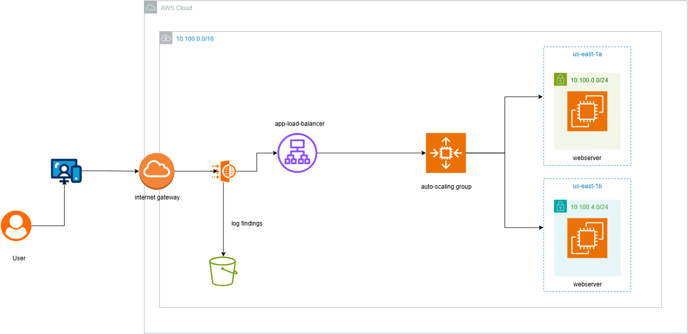
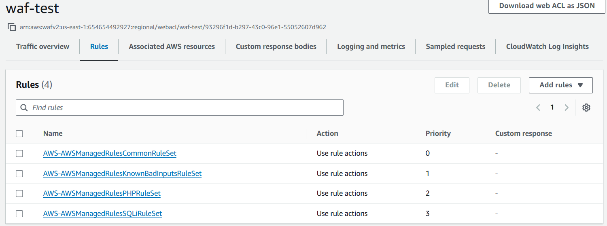
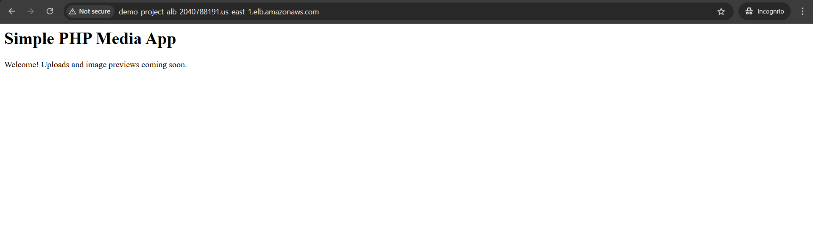
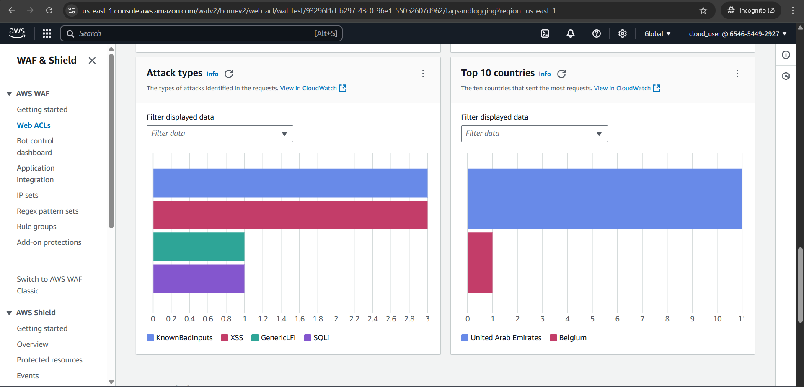

# Configure WAF to log to S3

A media application runs on a host of Amazon EC2 instances fronted with an Application Load Balancer (ALB) and Amazon S3 buckets as a storage service. For enhanced security, an AWS Web Application Firewall (AWS WAF) has been set up to monitor the requests coming to the ALB. The DevOps team needs to submit a quarterly report on the web requests received by AWS WAF, having detailed information about each web request as well as the details about the rules that the request matched. The team has reached out to you to implement the changes needed for collecting the security data for the coming months.
Using Terraform, implement the requirements.



## Structure Required

```sh
├── main.tf
├── variables.tf
├── modules/
│   ├── vpc/
│   ├── ec2/
│   ├── alb/
│   ├── asg/
│   ├── s3/
│   └── waf/
```

## Requirements

- Create an IAM role for the lunch template(EC2 instance profile) to access CodeDeploy.
- add s3 access to ec2 instance profile
- create s3 file which must start with ``aws-waf-logs-`` and use any suffix
- Add WAF rules



## Firing Waf rules or How to test the rules?

- ### Trigger AWSManagedRulesSQLiRuleSet

```sh
curl http://demo-project-alb-2040788191.us-east-1.elb.amazonaws.com/search.php?query=%27%20OR%201=1%20--%22
```

- ### Trigger AWSManagedRulesPHPRuleSet

```sh
curl http://demo-project-alb-2040788191.us-east-1.elb.amazonaws.com/.env
or 
curl -i "http://demo-project-alb-2040788191.us-east-1.elb.amazonaws.com/config.php.bak"
```

- ### Trigger AWSManagedRulesKnownBadInputsRuleSet

```sh
curl -i http://demo-project-alb-2040788191.us-east-1.elb.amazonaws.com/?input=%3Cscript%3Ealert(%27x%27)%3C/script%3E
or
curl -i http://demo-project-alb-2040788191.us-east-1.elb.amazonaws.com/?input=../../../../etc/passwd
```

## Where Are Logs Stored?

```sh
aws-waf-logs-myapp-prod/AWSLogs/<account-id>/WAFLogs/<web-acl-name>/YYYY/MM/DD/...
```

## After deploying the infrastructure using  Terraform

### - DNS name of the web application



### - Screenshot of AWS WAF findings



## How to use

- Run Terraform

```sh
terraform init
terraform apply --auto-approve
```

- Create Application in AWS Codedeploy manually.
- Zip by CD into the directory app.
- Upload the app and create the deployment.
- Create AWS WAF and add the rules from AWS Manged Rules
- Then Start Testing.
