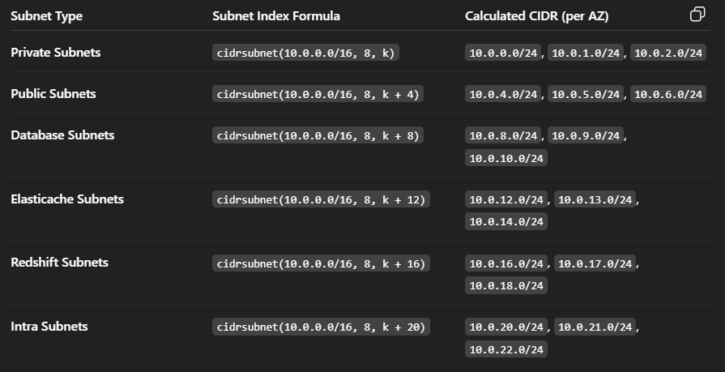

# How to caculate the subneting for these ?

```sh
locals {
    name      = "demo-project-vpc"
    vpc_cidr  = "10.0.0.0/16"
    azs       = ["us-east-1a", "us-east-1b", "us-east-1c"]
}

module "vpc" {
  source = "terraform-aws-modules/vpc/aws"
  version = "~> 6.0.0"

  name = local.name
  cidr = local.vpc_cidr

  azs                 = local.azs
  private_subnets     = [for k, v in local.azs : cidrsubnet(local.vpc_cidr, 8, k)]
  public_subnets      = [for k, v in local.azs : cidrsubnet(local.vpc_cidr, 8, k + 4)]
  database_subnets    = [for k, v in local.azs : cidrsubnet(local.vpc_cidr, 8, k + 8)]
  elasticache_subnets = [for k, v in local.azs : cidrsubnet(local.vpc_cidr, 8, k + 12)]
  redshift_subnets    = [for k, v in local.azs : cidrsubnet(local.vpc_cidr, 8, k + 16)]
  intra_subnets       = [for k, v in local.azs : cidrsubnet(local.vpc_cidr, 8, k + 20)]
}
```

